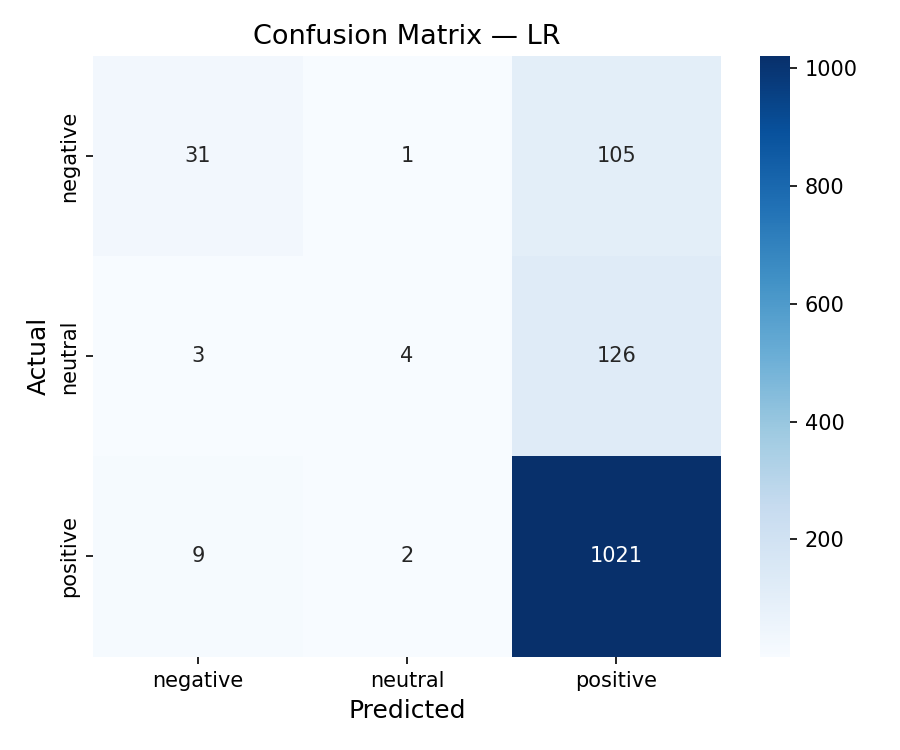
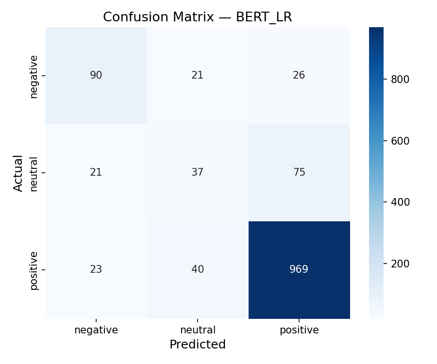
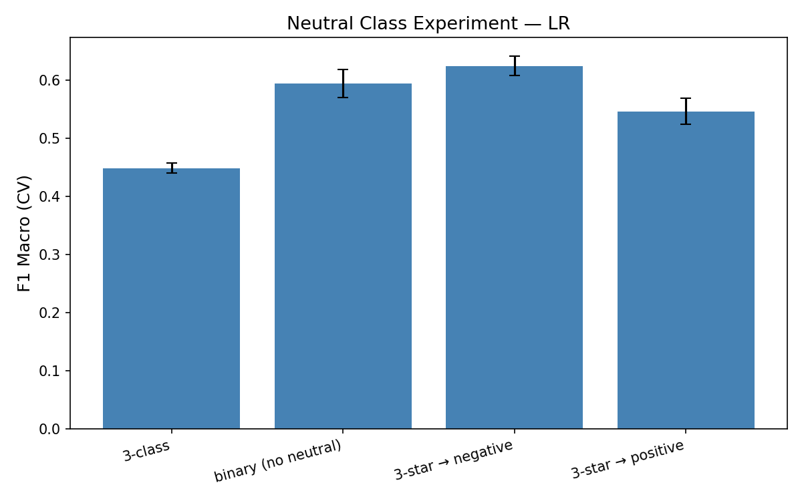
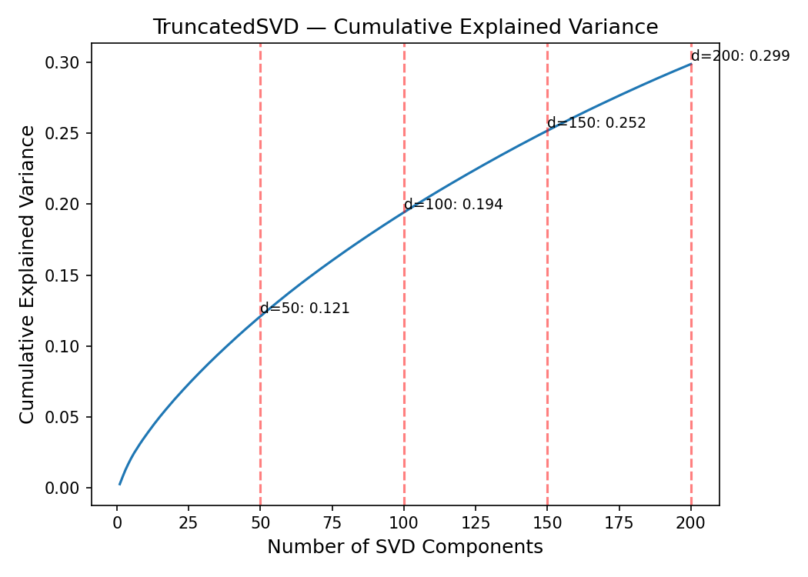
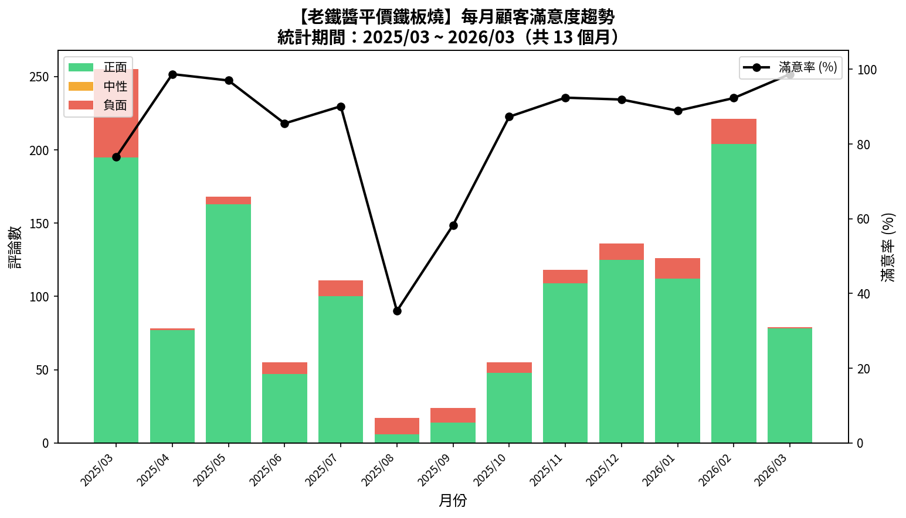
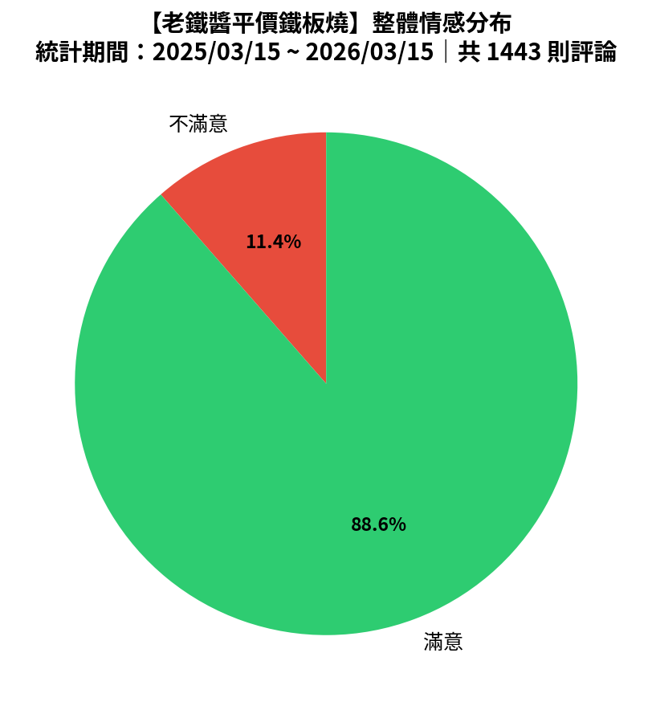
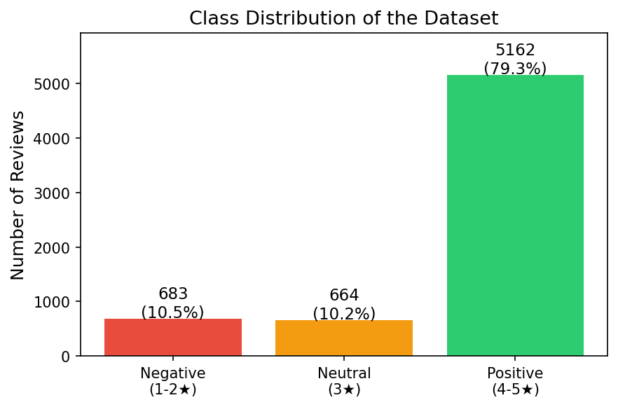
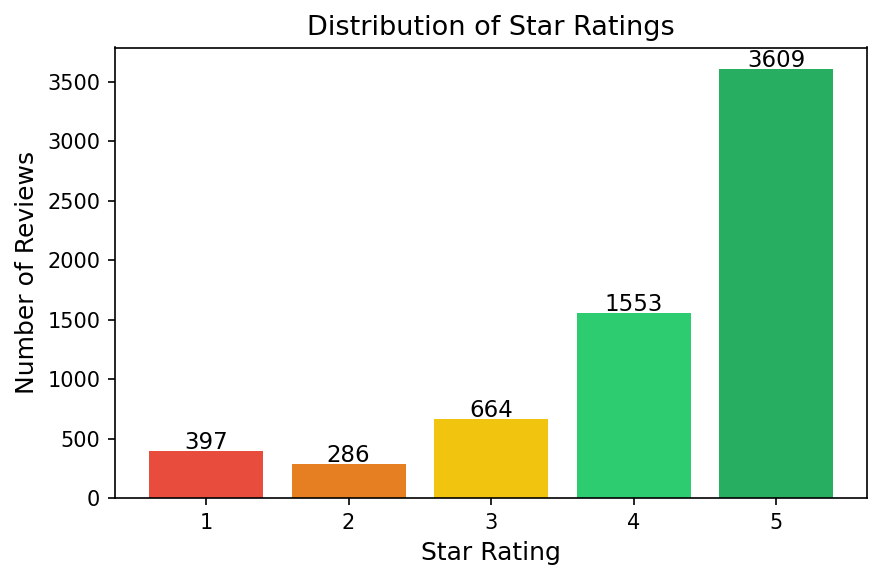

# Taiwan Food Review Sentiment Classification

NYCU AI Capstone 2026 Spring — Project #1
**Student:** Ian Tsai (313553058)

## Overview

Sentiment classification of 6,509 Taiwanese restaurant reviews from Google Maps using TF-IDF and BERT-based transfer learning. Our best model (**BERT+LR binary**) achieves **F1 = 0.826**.

## Key Results

### Model Comparison (3-class, 5-fold CV)

| Model | Accuracy | F1 Macro |
|-------|----------|----------|
| TF-IDF + LR | 0.818 | 0.449 |
| TF-IDF + SVM | 0.822 | 0.457 |
| BERT zero-shot | 0.815 | 0.559 |
| BERT + SVM | 0.798 | 0.328 |
| **BERT + LR** | **0.842** | **0.636** |
| **BERT + LR (binary)** | **0.892** | **0.826** |

### Confusion Matrices

<p align="center">
  
  
</p>
<p align="center"><i>Left: TF-IDF + LR | Right: BERT + LR — BERT significantly improves neutral/negative recall</i></p>

### Neutral Class Experiment — Cultural Insight

Reclassifying 3-star as negative yields the best F1 (0.625 → 0.826 with BERT), reflecting that in Taiwan, a 3-star rating typically signals dissatisfaction.

<p align="center">
  
</p>

### SVD Dimensionality Reduction

<p align="center">
  
</p>
<p align="center"><i>Even 200 dimensions capture only 30% variance — TF-IDF matrix is extremely sparse</i></p>

### Application: Restaurant Analysis Tool

A practical tool that analyzes any Google Maps restaurant's reviews and generates monthly sentiment trend reports.

<p align="center">
  
</p>
<p align="center">
  
</p>
<p align="center"><i>Demo: 1,443 reviews over 13 months — identified satisfaction dip in Aug 2025 (35.3%)</i></p>

## Dataset

> **Full documentation:** [`DATASET.md`](DATASET.md)
> **Raw data:** [`data/raw/reviews.csv`](data/raw/reviews.csv) (6,547 reviews)
> **Cleaned data:** [`data/processed/reviews_clean.csv`](data/processed/reviews_clean.csv) (6,509 reviews)

| Attribute | Value |
|-----------|-------|
| Source | Google Maps (Playwright crawler) |
| Total reviews | 6,509 |
| Restaurants | 218 |
| Regions | 18 (across Taiwan) |
| Positive (4-5★) | 5,162 (79.3%) |
| Neutral (3★) | 664 (10.2%) |
| Negative (1-2★) | 683 (10.5%) |

<p align="center">
  
  
</p>

## Methods — Three-Stage Evolution

1. **Stage 1:** jieba tokenization → TF-IDF (5000-d) → TruncatedSVD (150-d) → LR / SVM
2. **Stage 2:** XLM-RoBERTa-large embeddings (1024-d) → LR *(transfer learning)*
3. **Stage 3:** Reclassify 3-star as negative → binary BERT+LR *(best model, F1=0.826)*

## Project Structure

```
AI_HW1/
├── DATASET.md               # Dataset documentation
├── data/
│   ├── raw/reviews.csv              # 6,547 raw reviews
│   └── processed/reviews_clean.csv  # 6,509 cleaned reviews
├── src/
│   ├── collect.py           # Google Maps scraper (Playwright)
│   ├── preprocess.py        # jieba + TF-IDF + TruncatedSVD
│   ├── train.py             # LR + SVM + 5-fold CV
│   ├── train_mlp.py         # PyTorch MLP classifier
│   ├── evaluate.py          # Metrics + save_all_plots()
│   ├── experiments.py       # 5 ablation experiments
│   ├── bert_baseline.py     # BERT zero-shot (GPU)
│   ├── bert_features.py     # BERT embedding extraction (GPU)
│   ├── train_bert_svm.py    # BERT+LR/SVM training
│   ├── analyze_restaurant.py # Restaurant analysis tool
│   └── clean.py             # Data cleaning
├── results/
│   ├── figures/             # 25+ plots
│   ├── tables/              # 10 LaTeX tables
│   └── analysis/            # Restaurant analysis outputs
├── report/                  # LaTeX report for Overleaf
├── run_pipeline.py          # End-to-end runner
└── requirements.txt
```

## Quick Start

```bash
pip install -r requirements.txt

# Run full pipeline
python run_pipeline.py data/raw/reviews.csv

# Analyze a specific restaurant
python src/analyze_restaurant.py "https://maps.app.goo.gl/xxxxx"

# Analyze from existing CSV
python src/analyze_restaurant.py data.csv
```

## Experiments

1. **Learning Curve** — Performance scales steadily with data, no plateau at 100%
2. **Class Balance** — `balanced` weights: +19.5% F1 at cost of 16% accuracy
3. **SVD Dimensions** — 150-d SVD retains 97% of raw TF-IDF performance at 3% dimensionality
4. **Neutral Class** — 3-star → negative is the optimal strategy (cultural insight)
5. **Data Augmentation** — Minimal improvement for TF-IDF models
6. **Feature Comparison** — BERT embeddings +42% F1 over TF-IDF; binary +85% over baseline
